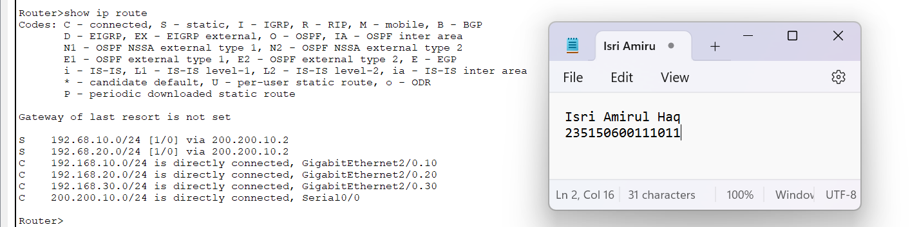
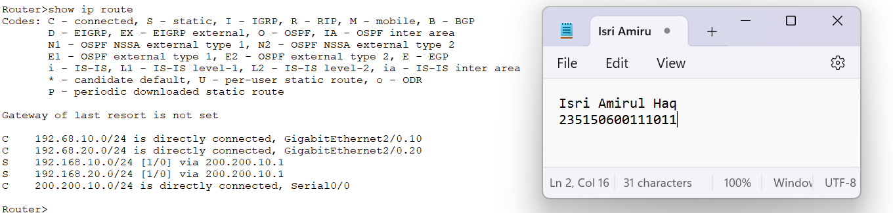
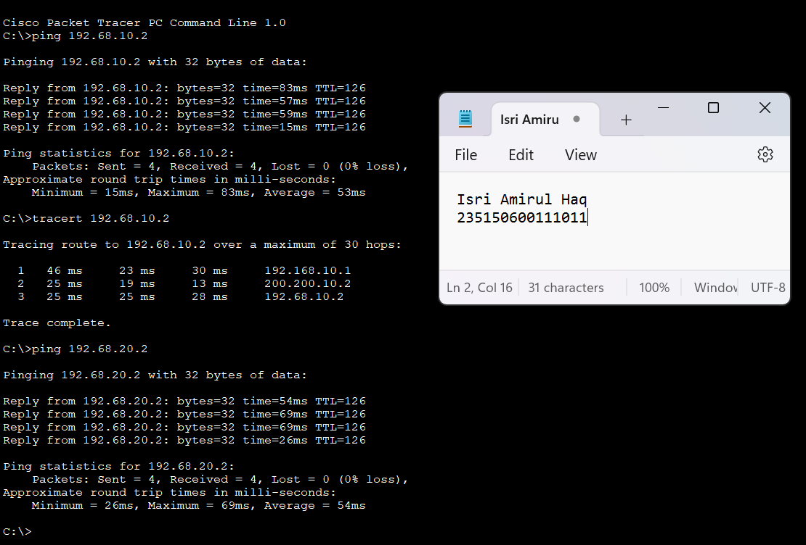

# Praktikum 13 - Static Routing dengan Konfigurasi VLAN


PT Mencari Cinta saat ini memiliki 2 LAN yang masing2 LAN nya memiliki VLAN tersendiri. Pada LAN kiri terdapat VLAN departemen HR dan departemen sales. Pada LAN kanan terdapat VLAN departemen product dan departemen developer.

PT Mencari Cinta melakukan permintaan untuk yang LAN kiri menggunakan DHCP Server untuk layanan DHCP dan yang LAN kanan menggunakan DHCP Router untuk layanan DHCP.

Sebagai network engineer, bantu PT mencari cinta untuk melakukan konfigurasi jaringan supaya masing2 VLAN bisa saling berkomunikasi satu sama lain

Untuk konfigurasi packet tracer awal dapat diunduh pada file [Latihan VLAN 2.pkt](./pkt/latihan_vlan_2.pkt) atau bisa dilihat pada grup whatsapp.

## Konfigurasi VLAN pada LAN 1

Masuk ke CLI Switch LAN 1 lalu ketikkan perintah berikut

```zsh
enable
conf t
vlan 10
name HR
exit

vlan 20
name sales
exit

vlan 30
name DHCP
exit
```

Setelah itu, masukkan VLAN HR ke port Fa2/1, VLAN sales ke port Fa1/1 dan VLAN DHCP ke port Fa3/1

```zsh
int fa2/1
switchport mode access
switchport access vlan 10
ex

int fa1/1
switchport mode access
switchport access vlan 20
ex

int fa3/1
switchport mode access
switchport access vlan 30
ex
```

Lalu kita buat network yang mengarah ke router menjadi trunk dengan perintah berikut

```zsh
int g0/1
switchport mode trunk
```

Setelah itu, kita lakukan konfigurasi inter-VLAN routing. Masuk ke CLI router kiri, lalu ketikkan perintah berikut untuk menyalakan port gig2/0
```zsh
enable
conf t
int gig2/0
no sh
exit
```

Setelah itu, kita buat sub interface untuk VLAN 10, 20 dan 30
```zsh
int gig2/0.10
encapsulation dot1Q 10
ip add 192.168.10.1 255.255.255.0
exit

int gig2/0.20
encapsulation dot1Q 20
ip add 192.168.20.1 255.255.255.0
exit

int gig2/0.30
encapsulation dot1Q 30
ip add 192.168.30.1 255.255.255.0
exit
```

Setelah itu, kita harus pastikan interface G2/0 beserta sub interface yang sudah dibuat berada dalam status up dengan perintah pada global (bukan conf t)

```zsh
sh ip int br
```


Pada server DHCP di LAN 1, lakukan konfigurasi ip secara statis dengan info berikut

Field | Value | 
--- | --- |
IPv4 Address | 192.168.30.2 | 
Subnet Mask | 255.255.255.0 | 
Default Gateway | 192.168.30.1 | 

Lalu masuk ke services DHCP, nyalakan service DHCP dan tambahkan 2 pool dengan detail informasi berikut

- Pool 1 (HR Pool)

    Field | Value | 
    --- | --- |
    Pool Name | HR Pool | 
    Default Gateway | 192.168.10.1 |
    Start IP Address | 192.168.10.2 | 

- Pool 2 (Sales Pool)

    Field | Value | 
    --- | --- |
    Pool Name | Sales Pool | 
    Default Gateway | 192.168.20.1 |
    Start IP Address | 192.168.20.2 | 

Setelah itu, masuk ke router lagi dan masuk ke sub interface VLAN 10

```zsh
int g2/0.10 
ip helper-address 192.168.30.2
ex

int g2/0.20
ip helper-address 192.168.30.2
ex
```

Setalah itu, coba lakuakn request alamat secara DHCP pada VLAN HR dan VLAN Sales

## Konfigurasi VLAN pada LAN 2

Masuk ke CLI Switch LAN 2 lalu ketikkan perintah berikut

```zsh
enable
conf t
vlan 10
name Product
exit

vlan 20
name Developer
exit
```

Setelah itu, masukkan VLAN Product ke port Fa1/1, VLAN Developer ke port Fa2/1

```zsh
int fa1/1
switchport mode access
switchport access vlan 10
ex

int fa2/1
switchport mode access
switchport access vlan 20
ex
```

Lalu kita buat network yang mengarah ke router menjadi trunk dengan perintah berikut

```zsh
int g0/1
switchport mode trunk
```

Setelah itu, kita lakukan konfigurasi inter-VLAN routing. Masuk ke CLI router kanan, lalu ketikkan perintah berikut untuk menyalakan port gig2/0
```zsh
enable
conf t
int gig2/0
no sh
exit
```

Setelah itu, kita buat sub interface untuk VLAN 10 dan 20
```zsh
int gig2/0.10
encapsulation dot1Q 10
ip add 192.68.10.1 255.255.255.0
exit

int gig2/0.20
encapsulation dot1Q 20
ip add 192.68.20.1 255.255.255.0
exit
```

Lalu, kita lakukan konfigurasi DHCP pada router dengan perintah berikut

```zsh
ip dhcp pool ProductPool
network 192.68.10.0 255.255.255.0
default-router 192.68.10.1
dns-server 8.8.8.8
exit

ip dhcp pool DeveloperPool
network 192.68.20.0 255.255.255.0
default-router 192.68.20.1
dns-server 8.8.8.8
exit
```

Untuk mengecek pool DHCP yang telah dibuat, kamu bisa menjalankan perintah berikut pada global (bukan conf t)

```zsh
sh ip dhcp pool
```

Apabila benar, maka harusnya muncul output seperti gambar dibawah ini


Setelah itu, buka PC pada salah satu LAN kanan, lalu seharusnya kalian bisa melihat bahwa ip setiap end device sudah otomatis di set ke DHCP apabila benar.

# Routing antar LAN

Untuk routing antar LAN yang memiliki VLAN, saya berikan kalian kebebasan untuk turut membantu mengembangkan modul ini dengan melakukan fork repository ini, tambahkan section ini lalu bikin pull request dan kalian akan mendapatkan poin keaktifan +2 apabila konten yang kalian buat valid.

Berikut ketentuan tugas bonus ini:
- Deadline perancangan modul beserta konten section ```Routing antar LAN``` hari ini
- Berisi langkah beserta screenshot yang jelas
- Tiap langkah harus dibuat mengikuti kaidah seperti dibawah


# Konfigurasi pada Router 0
Konfigurasikan interface Serial Se0/0 dengan alamat IP dan aktifkan interface
```zsh
int S0/0
ip add 200.200.10.1 255.255.255.0
no sh
exit
```

Tambahkan routing statis untuk mengarahkan lalu lintas ke subnet pada LAN yang dikelola Router 1 melalui Router 1
```zsh
ip route 194.68.10.0 255.255.255.0 200.200.10.2
ip route 192.68.20.0 255.255.255.0 200.200.10.2
```

Periksa apakah konfigurasi routing sudah benar dengan melihat tabel routing
```zsh
show ip route
```

Apabila sudah benar, maka outputnya akan seperti di bawah ini



# Konfigurasi pada Router 1
Konfigurasikan interface Serial Se0/0 pada Router 1 dengan alamat IP dan aktifkan interface
```zsh
int S0/0
ip add 200.200.10.2 255.255.255.0
no sh
exit
```

Tambahkan routing statis untuk mengarahkan lalu lintas ke subnet pada LAN yang dikelola Router 0 melalui Router 0
```zsh
ip route 192.168.10.0 255.255.255.0 200.200.10.1
ip route 192.168.20.0 255.255.255.0 200.200.10.1
```

Periksa apakah konfigurasi routing sudah benar dengan melihat tabel routing
```zsh
show ip route
```

Apabila sudah benar, maka outputnya akan seperti di bawah ini



Kita dapat menguji routingnya benar dengan melakukan ping atau tracert pada comment prompt
```zsh
tracert [alamat ip]
```

Apabila sudah benar, maka outputnya akan seperti di bawah ini


Yang paling rapih dan jelas akan dimerge ke repository ini dan mendapatkan poin keaktifan +6
